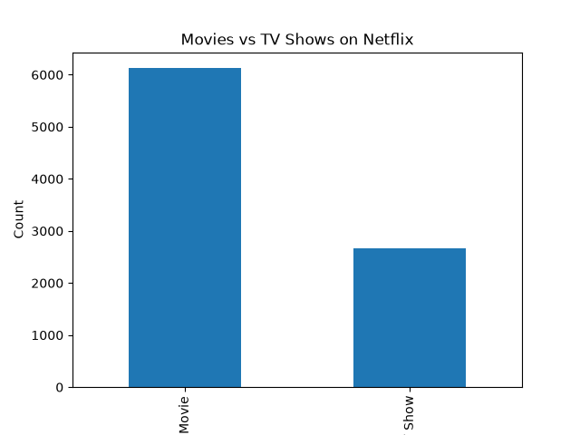
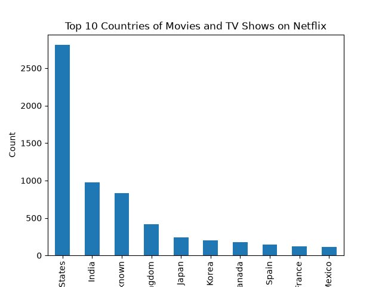
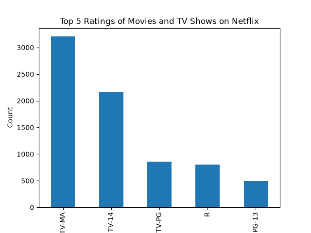

# 📊 Netflix Titles - Exploratory Data Analysis (EDA)

## 📌 Overview
This project performs an Exploratory Data Analysis (EDA) on the [Netflix Titles dataset](https://www.kaggle.com/datasets/shivamb/netflix-shows), which contains information about movies and TV shows available on Netflix as of 2021. The goal is to clean the raw data, uncover patterns, and answer key questions about Netflix's content library.

## 🛠️ Tools Used
- **Python 3.14**
- **Pandas** — data loading, cleaning, and analysis
- **Matplotlib** — data visualization
- **VS Code** — development environment

## 📂 Dataset
- **Source:** Kaggle - Netflix Movies and TV Shows
- **File:** `netflix_titles.csv`
- **Original size:** 8,807 rows × 12 columns

## 🧹 Data Cleaning

The raw dataset contained missing values in several columns. Here's how each was handled:

| Column | Missing Values | Action Taken | Reasoning |
|---|---|---|---|
| `director` | 2,634 (~30%) | Filled with `"Unknown"` | Too large a portion to drop without losing significant data |
| `cast` | 825 (~9%) | Filled with `"Unknown"` | Same reasoning — preserve the rest of the row's data |
| `country` | 831 (~9%) | Filled with `"Unknown"` | Same reasoning |
| `date_added` | 10 (~0.1%) | Rows dropped | Negligible impact on dataset size |
| `rating` | 4 (~0.05%) | Rows dropped | Negligible impact on dataset size |
| `duration` | 3 (~0.03%) | Rows dropped | Negligible impact on dataset size |

**Result:** Dataset cleaned from 8,807 → 8,790 rows, with **zero missing values** and **zero duplicate rows**.

## 📈 Key Findings

### 1. Movies dominate the platform
Netflix's library is composed of roughly **70% Movies (6,126)** and **30% TV Shows (2,664)**.



### 2. The United States leads content production by a wide margin
Followed distantly by India, then the UK, Japan, and South Korea.

| Country | Titles |
|---|---|
| United States | 2,809 |
| India | 972 |
| United Kingdom | 418 |
| Japan | 243 |
| South Korea | 199 |



### 3. Most content is rated for mature audiences
**TV-MA** (Mature Audience) is the most common rating (3,205 titles, ~36%), followed by **TV-14** (2,157). This suggests Netflix's catalog leans toward adult/teen content rather than children's programming.



### 4. Release years: a mix of classics and recent content
- **Mean release year:** 2014
- **Median release year:** 2017
- **Range:** 1925 – 2021

The median being higher than the mean indicates a small number of older "classic" titles are pulling the average down, while the bulk of the catalog is actually recent (post-2017).

## ✅ Conclusions

- Netflix's catalog is primarily built around **movies**, not TV series.
- **US-produced content dominates**, though the platform includes global content from India, the UK, and several other countries.
- The platform is **skewed toward mature/teen audiences** rather than children's content.
- While Netflix carries a few decades-old titles, **most of its content is relatively recent** (majority released after 2017).

## 🚀 How to Run
```bash
pip install pandas matplotlib
python eda_project.py
```

## 📁 Project Structure
```
├── eda_project.py       # Main analysis script
├── netflix_titles.csv   # Dataset
└── README.md            # This file
```

---
*Part of a self-directed AI/ML learning roadmap — Phase 2: Data Analysis & EDA project.*
